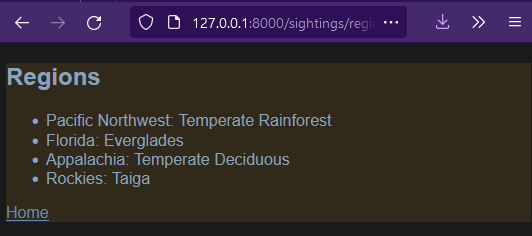

# bigfoot-sightings-reporter
A mock web app with django for reporting sightings of everyone's favorite cryptid

---

---
## Features

- Block styled html for rapid insertion.
- Form redirects with improper input.
- Validates data before saving and redirecting.

---
## Samples

---
## About

This is a project for fun to learn the ins and outs of the Django web framework. My source material was for a business meeting planner, but it's much more fun this way. No bigfoots were harmed in the making of this repository.

---
## License
[GNU GENERAL PUBLIC LICENSE](LICENSE)